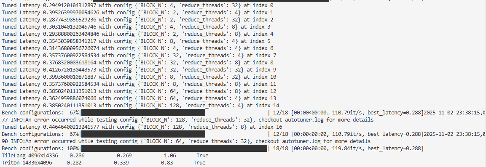
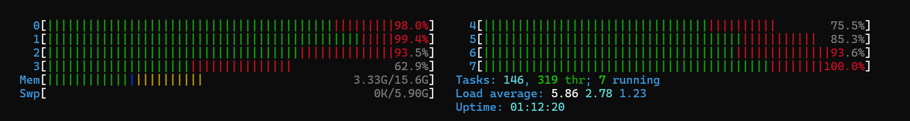

# Triton and TileLang kernel

## gemv

Triton vs Naive TileLang
```
Shape           Ref Time (ms)   Custom Time (ms) Speedup    Accuracy  
---------------------------------------------------------------------------
Triton 1024x1024     0.023           0.040           0.58       True      
TileLang 1024x1024     0.023           0.304           0.08       True      
Triton 4096x4096     0.095           0.101           0.94       True      
TileLang 4096x4096     0.095           0.884           0.11       True      
Triton 4096x14336    0.283           0.282           1.00       True      
TileLang 4096x14336    0.283           1.734           0.16       True      
Triton 14336x4096     0.279           0.334           0.84       True      
TileLang 14336x4096     0.279           3.085           0.09       True  
```


Triton vs splitk TileLang
```
Shape           Ref Time (ms)   Custom Time (ms) Speedup    Accuracy  
---------------------------------------------------------------------------
Triton 1024x1024     0.022           0.039           0.57       True      
TileLang 1024x1024     0.022           0.032           0.70       True      
Triton 4096x4096     0.098           0.112           0.87       True      
TileLang 4096x4096     0.098           0.096           1.02       True      
Triton 4096x14336    0.285           0.281           1.01       True      
TileLang 4096x14336    0.285           0.289           0.99       True      
Triton 14336x4096     0.279           0.334           0.84       True      
TileLang 14336x4096     0.279           0.315           0.89       True    
```

Triton vs TileLang autotunner
```
Shape           Ref Time (ms)   Custom Time (ms) Speedup    Accuracy  
---------------------------------------------------------------------------
Triton 1024x1024     0.025           0.040           0.61       True      
TileLang 1024x1024     0.025           0.032           0.78       True      
Triton 4096x4096     0.095           0.110           0.86       True      
TileLang 4096x4096     0.095           0.082           1.15       True      
Triton 4096x14336    0.284           0.278           1.02       True      
TileLang 4096x14336    0.284           0.267           1.07       True      
Triton 14336x4096     0.279           0.336           0.83       True      
TileLang 14336x4096     0.279           0.273           1.02       True   
```

## TileLang autotunner 
Use all cpu cores when do autotuning




## TileLang gen code
TileLang will gen cuda code `.cu` after compiler the TL kernel at the first time to call, and then will skip compile step at the after calls.
```bash
root@ubuntu22:~/workspace# ll ~/.tilelang/cache/081a966e28eddfe4974bf45e96233cc9994aeed6ebf6516b79cd7afd58ef1277/
total 1060
drwxr-xr-x   2 root root    4096 11月  2 23:35 ./
drwxr-xr-x 130 root root   20480 11月  2 23:39 ../
-rw-r--r--   1 root root    2528 11月  2 23:35 kernel.cu
-rw-r--r--   1 root root 1047672 11月  2 23:35 kernel_lib.so
-rw-r--r--   1 root root     154 11月  2 23:35 params.pkl
-rw-r--r--   1 root root    2993 11月  2 23:35 wrapped_kernel.cu
```


## RMSNorm

Triton
```bash
Testing on: cuda (3080 10G)
Shape           Ref Time (ms)   Custom Time (ms) Speedup    Accuracy  
---------------------------------------------------------------------------
Triton 1x4096     0.047           0.022           2.17       True      
TileLang 1x4096     0.047           0.019           2.52       True      
Triton 4096x4096     0.897           0.020           44.92      True      
TileLang 4096x4096     0.897           0.100           8.99       True      
Triton 4096x14336    3.078           0.020           153.41     True      
TileLang 4096x14336    3.078           0.501           6.14       True      
Triton 14336x4096     3.079           0.020           154.90     True      
TileLang 14336x4096     3.079           0.341           9.03       True 
```